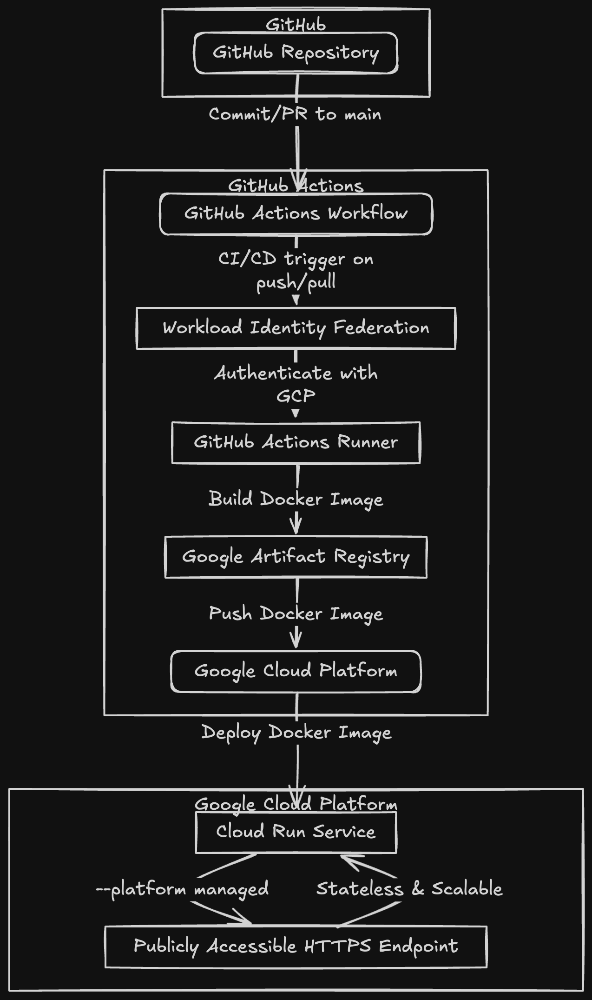

# Travel Itinerary API

A robust RESTful API service for managing travel itineraries, built with Express.js and TypeScript. This API provides features for creating, managing, and sharing travel itineraries with security best practices.

## Features

- User authentication and authorization
- CRUD operations for travel itineraries
- Rate limiting and security measures
- Caching for improved performance
- Comprehensive logging
- Input validation
- MongoDB integration for data persistence

## Tech Stack

- Node.js
- Express.js
- TypeScript
- MongoDB (Mongoose)
- JWT for authentication
- Winston for logging
- Docker for containerization

## Prerequisites

- Node.js (v20 or higher)
- MongoDB
- Docker (optional, for containerized deployment)

## Installation

1. Clone the repository:

```bash
git clone <repository-url>
cd travel-itenary-api
```

2. Install dependencies:

```bash
npm install
```

3. Create a `.env` file in the root directory with the following variables:

```env
PORT=3000
MONGODB_URI=your_mongodb_uri
JWT_SECRET=your_jwt_secret
NODE_ENV=development
```

## Development

Run the development server:

```bash
npm run dev
```

## Building

Build the TypeScript project:

```bash
npm run build
```

## Running in Production

Start the production server:

```bash
npm start
```

## Docker Deployment

Build the Docker image:

```bash
docker build -t travel-itinerary-api .
```

Run the container:

```bash
docker run -p 3000:3000 travel-itinerary-api
```

## API Documentation

For detailed API documentation, please visit our Postman documentation:
[API Documentation](https://documenter.getpostman.com/view/15392140/2sB2j96U8C)

The documentation includes:

- Authentication endpoints
- User management
- Itinerary operations
- Request/response examples
- Environment setup

## Live Demo

The API is currently deployed and accessible at:
[Live API Endpoint](https://itineary-api-141134708680.asia-south1.run.app)

### Demo Credentials

You can use the following credentials to test the API:

- Email: john@example.com
- Password: password123

## Security Features

- Helmet for security headers
- Rate limiting
- CORS configuration
- Input validation using Joi
- Password hashing with bcrypt
- JWT authentication

## Scripts

- `npm start`: Run the production server
- `npm run dev`: Run the development server with hot-reload
- `npm run build`: Build the TypeScript project
- `npm run seed`: Seed the database with initial data

## License

ISC

## Author

sahiljamwal

## Deployment Architecture



The above diagram illustrates our CI/CD pipeline and deployment architecture, showing how code changes flow from development to production.
